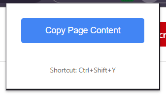

# Page Content Copier Chrome Extension

## Purpose

## Feature Implementations

Page Content Copier is a Chrome extension designed to help users quickly copy the entire content of a webpage in a structured, readable format. This is especially useful for providing content to Large Language Models (LLMs), making it easier for them to process, summarize, or analyze the information. By preserving the structure of the page, the extension ensures that the copied content is easy to read and work with, reducing the time spent on manual formatting or sifting through cluttered text.

## Why Use This Extension?
- **Efficient Content Extraction:** Instantly copy the main content of any webpage with a single click or keyboard shortcut.
- **Structured Output:** The extension preserves headings, lists, paragraphs, and other formatting, making the copied text ideal for LLMs and human readers alike.
- **Reduces Reading Time:** By providing clean, well-structured text, you can quickly review or process information without unnecessary clutter.
- **Open Source & Collaborative:** This project is open source. Feel free to contribute, suggest features, or help improve the extension for everyone.

## Top Use Cases
- **Feeding Content to LLMs:** Prepare web content for input into ChatGPT, Claude, Gemini, or other LLMs, ensuring better comprehension and results.
- **Summarization & Analysis:** Quickly copy structured text for summarization, note-taking, or further analysis.
- **Research & Study:** Extract readable content from articles, blogs, or documentation for easier review and study.
- **Content Curation:** Gather and organize information from multiple sources without losing structure.

## How It Works
- Click the extension icon or use the keyboard shortcut (**Ctrl+Shift+Y**) to copy the current page's content.
- The extension processes the page, removes unnecessary elements, and copies the structured text to your clipboard.
- Paste the content wherever you need—LLMs, notes, documents, or emails.

### Test Area Selection
This feature allows users to select a specific area of a webpage to test how the extension copies structured content. By selecting a region, you can verify that the extension preserves formatting and structure, making it ideal for LLM input and reducing manual cleanup. This is especially useful for developers and contributors who want to ensure the extension works as intended on different types of web content.

## Contribution
This project is open source and welcomes contributions! If you have ideas, bug fixes, or want to make the extension even better, please open an issue or submit a pull request.

---

**Make your web content LLM-ready, readable, and easy to use—without the clutter!**
